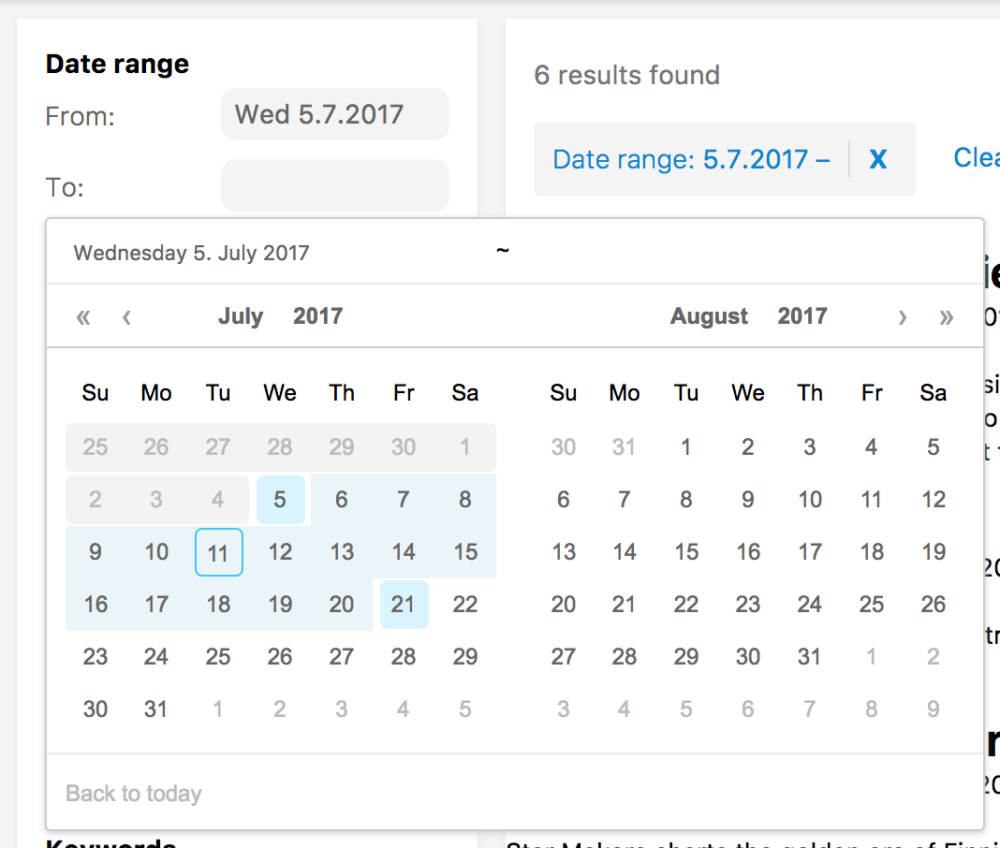

# searchkit-datefilter
A calendar-style date filter component for Searchkit

---

This Searchkit filter lets users filter start-end date ranges based on a chosen start time and an optional end time.

See demo directory for a working example.



## Example component

```jsx

import { SearchkitComponent } from "searchkit";
import { DateRangeFilter, DateRangeCalendar } from "searchkit-datefilter"

class App extends SearchkitComponent {

  render(){
    <div>
     <DateRangeFilter
        id="event_date"
        title="Date range"
        fromDateField="event_date.from"
        toDateField="event_date.to"
        calendarComponent={DateRangeCalendar}
        fieldOptions={{
          type: 'embedded',
          options: {
            path: 'event_date'
          }
        }}
      />
    </div>
  }
}
```

### Loading CSS from the module

If you're using Searchkit CSS, this module should match that pretty well.

```css
@import '../node_modules/searchkit/release/theme.css';
@import '../node_modules/searchkit-datefilter/release/theme.css';
```

Note that this is an illustrative example; in actual use you probably want to set up a resolve alias for your `node_modules` dir or use `~` if your loader supports it.

#### Not seeing those styles...

A quick fix is to add the parameter `url=false` to your CSS loader, but note that this will break imports that use `url()`.

```js
{
  test: /\.css$/,
  loader: 'style!css?importLoaders=1&url=false!postcss'
},
```

A better solution is to set up [css-raw-loader](https://www.npmjs.com/package/css-raw-loader).

## Props
- `fromDateField` *(ESField)*: **Required.** An elasticsearch date field to use as the beginning.
- `toDateField` *(ESField)*: **Required.** An elasticsearch date field to use as the end.
- `id` *(string)*: Required. id of component. Must be unique. Used as key for url serialisation
- `title` *(string)*: **Required.** Title used for component and for selected filters component
- `calendarComponent` *(ReactComponent)*: Calendar component to use when rendering
    - Compatible with `DateRangeCalendar`
    - Defaults to `DateRangeFilterInput` which just shows two date math input fields
- `fieldOptions` *({type:"embedded|nested|children", options:Object})* Configures the type field that is stored in ElasticSearch, can be `embedded` or `nested` or `children`
    - `type:nested` requires `options.path` provided
    - `type:children` requires `options.childType` provided
    - see [Field Options](http://docs.searchkit.co/stable/core/FieldOptions.html) in Searchkit documentation
- `rangeFormatter` *((count:number)=> string|number)* A formatter function used to convert numbers into more readable display values. E.g. long number formatting or prefixing currencies.`

## Troubleshooting

### Errors

> Warning: Failed context type: Invalid context 'searchkit' of type 'SearchkitManager' supplied to 'DateRangeFilter', expected instance of 'SearchkitManager'

Webpack is bundling searchkit twice. See [webpack/webpack#2134](https://github.com/webpack/webpack/issues/2134).

To resolve this in your project, you will need to add something like this to `webpack.config.js`:

```
resolve: {
  alias: {
    'searchkit': path.resolve(path.join(process.cwd(), 'node_modules', 'searchkit'))
  }
}
```

